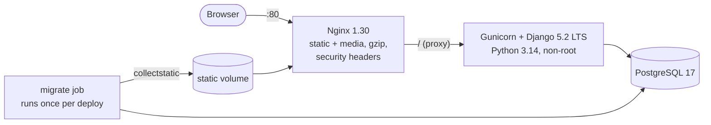

# KoffeeCart

[](https://github.com/NguyenVietThanhAn1/koffeecart/actions/workflows/ci.yml)

A coffee e-commerce shop built with Django, run the way a small production service would be:
containerised behind Nginx, tested on PostgreSQL in CI, scanned for vulnerabilities, and deployed
with health checks and automatic rollback.

This is a DevOps portfolio project. The shop itself started from the *GreatKart* Django course;
the infrastructure, CI/CD, security fixes, tests and the Bootstrap 5 UI were built on top of it.
What was wrong with the original and how each problem was fixed is written up in
[docs/incidents.md](docs/incidents.md).

## Features

- Marketplace-style catalogue (layout ideas from Amazon and Shopee, coffee colours): search with a
  category picker, filters (price, rating, in stock, on sale), sorting (popular, latest, top sales,
  top rated, price), sale prices with discount badges, "sold" counts, related products
- Product page with size/colour chips, quantity picker, "Add to cart" and "Buy now", and an
  Amazon-style rating breakdown; reviews only from buyers, marked "Verified purchase"
- Guest cart that merges into the user's cart on login
- Checkout with **cash on delivery**: the server decides amount, status and transaction id;
  stock is reserved with row locks so the last item cannot be sold twice
- Accounts: email activation, password reset, profile, order history with progress steps,
  printable invoices, cancel an order while it is still new (stock goes back)
- Bootstrap 5.3 UI, responsive down to phone width, no jQuery, strict Content-Security-Policy
- `robots.txt`, `sitemap.xml` and per-product meta / Open Graph tags

## Architecture



| Service | Image | Notes |
| --- | --- | --- |
| `nginx` | `nginx:1.30-alpine` | serves `/static/` and `/media/` itself, proxies the rest; `/nginx-health` for its healthcheck |
| `web` | built from `Dockerfile` | multi-stage, runs as uid 1000, `HEALTHCHECK` on `/health/` (checks the DB too) |
| `migrate` | same image as `web` | one-shot: `migrate` + `collectstatic`; `web` starts only after it succeeds |
| `db` | `postgres:17-alpine` | named volume, `pg_isready` healthcheck |

## Run it locally (no Docker)

Needs Python 3.14 (`uv python install 3.14` if you use [uv](https://docs.astral.sh/uv/)).

```bash
python -m venv .venv && source .venv/bin/activate        # Windows: .venv\Scripts\activate
pip install --require-hashes -r requirements.txt -r requirements-dev.txt
export SECRET_KEY=dev DEBUG=True ALLOWED_HOSTS=localhost,127.0.0.1
python manage.py migrate
python manage.py seed_demo          # categories, 17 products (generated photos), sales, orders, reviews
python manage.py createsuperuser    # admin is at /securelogin/
python manage.py runserver
```

Without `DB_*` variables the app uses SQLite. Emails are printed to the console.

## Run it with Docker

```bash
# development: Django runserver with code reload, Postgres in a container
cp .env.example .env      # fill in SECRET_KEY and DB_*
docker compose up --build

# production stack: Nginx + Gunicorn + Postgres
cp .env.example .env.prod # fill in real values, DEBUG=False
docker compose --env-file .env.prod -f docker-compose.prod.yml up -d --build --wait
docker compose --env-file .env.prod -f docker-compose.prod.yml exec web python manage.py seed_demo
```

### Environment variables

| Variable | Default | Purpose |
| --- | --- | --- |
| `SECRET_KEY` | *(required)* | Django secret key |
| `DEBUG` | `False` | never `True` in production |
| `ALLOWED_HOSTS` | `localhost` | comma separated; keep `localhost` for the container healthcheck |
| `CSRF_TRUSTED_ORIGINS` | `http://localhost` | comma separated, with scheme |
| `DB_ENGINE`, `DB_NAME`, `DB_USER`, `DB_PASSWORD`, `DB_HOST`, `DB_PORT` | SQLite | `django.db.backends.postgresql` in Docker |
| `EMAIL_BACKEND`, `EMAIL_HOST`, `EMAIL_PORT`, `EMAIL_USE_TLS`, `EMAIL_HOST_USER`, `EMAIL_HOST_PASSWORD` | console backend | SMTP for real mail |
| `SESSION_COOKIE_SECURE`, `CSRF_COOKIE_SECURE`, `SECURE_SSL_REDIRECT`, `SECURE_HSTS_*` | off | turn on only behind HTTPS ([docs/CI_CD.md](docs/CI_CD.md#turning-on-https-hardening)) |

`.env.example` lists them all. Real values never go into git.

## CI/CD

```
lint ──► test ──┐
                ├──► build (scan + smoke test + push) ──► deploy   (main only)
security ───────┘
```

- **lint**: ruff, shellcheck, `manage.py check --deploy --fail-level WARNING`, `makemigrations --check`
- **test**: pytest on a real PostgreSQL 17 service (row-lock tests only mean something there), coverage gate 90%
- **security**: `pip-audit` on the hashed lock file, Trivy filesystem scan (vulnerabilities, secrets, misconfiguration)
- **build**: the image is built **once**, scanned by Trivy, started as the full production stack
  (`docker compose up --wait`, no `sleep`), smoke-tested (pages, rate limit, demo data, backup,
  restore drill, full restore, monitor), then pushed as `sha-<commit>`
- **deploy**: a self-hosted runner on the server runs `./deploy.sh sha-<commit>`: pull, replace
  containers, wait for `/health/`, **roll back automatically** if the new version is not healthy

Actions are pinned to commit SHAs; Dependabot updates Python packages, base images and actions weekly.
Setup steps and manual deploy/rollback commands: [docs/CI_CD.md](docs/CI_CD.md).

## Security

- Dependencies are locked with sha256 hashes (`uv pip compile --generate-hashes`) and installed with `--require-hashes`
- Content-Security-Policy `script-src 'self'; style-src 'self'`: no inline scripts or styles anywhere,
  vendored front-end libraries (Bootstrap checked against the npm registry's sha512)
- Payment status and amounts are decided on the server; the client only sends the order number
- Every state-changing action is a POST with a CSRF token (cart buttons, logout)
- Ownership checks on orders and cart lines (no IDOR), safe redirects only, password validators,
  no user enumeration on "forgot password"
- Container runs as a non-root user; secrets come from the environment

## Operations

Full server guide: [docs/DEPLOY_LINUX.md](docs/DEPLOY_LINUX.md).

```bash
./monitor.sh                          # health report; exit code 1 on a critical problem
backups/backup.sh                     # verified pg_dump (gzip + "dump complete" footer), 7-day retention
backups/restore-drill.sh              # restore the newest dump into a throwaway DB and check it
backups/backup.sh restore FILE --yes  # restore over the live database
sudo deploy/systemd/install.sh        # nightly backup + weekly restore drill as systemd timers
```

- **Backups** are verified when taken and proven restorable every week; `BACKUP_OFFSITE` copies them
  off the server with rclone. CI runs backup, drill and a full restore on every build.
- **Rate limiting** in Nginx: 10 POSTs/min per IP on login, register and password forms; 20 req/s per IP overall.
- **Uptime alerts**: optional Uptime Kuma (`--profile monitoring`), reachable only through an SSH tunnel.

## Tests

```bash
pytest -q --cov             # 150+ tests; on SQLite the 2 row-lock tests are skipped
ruff check .
pip-audit -r requirements.txt --require-hashes --disable-pip
```

Every bug fixed in this project has a regression test that failed before the fix.

## Project layout

```
accounts/   users, activation, password reset, dashboard
category/   product categories
store/      products, variations, reviews, search, seed_demo command
carts/      guest and user carts, totals (carts/pricing.py)
orders/     checkout, COD payment, order emails
koffeecart/ settings, URLs, /health/, security headers middleware, static assets
templates/  Bootstrap 5 templates
nginx/      Nginx config (rate limits)   backups/  backup, restore, restore drill
deploy/     systemd timers for backups
docs/       CI/CD guide, audit and upgrade plans, incident write-ups
```

## Credits

Based on the GreatKart e-commerce course project. Product photos in the demo data are drawn by
`seed_demo` with Pillow; the banner is the project's own artwork.
